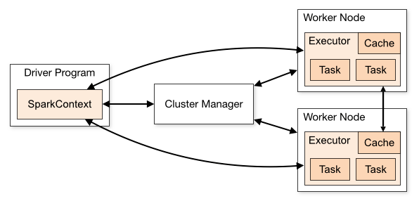

# PySpark
PySpark is a Spark library written in Python to run Python application using Apache Spark capabilities, using PySpark we can run applications parallelly
on the distributed cluster (multiple nodes). 
Pyspark is alternative to mapreduce in Hadoop. 
# Features
1. In-memory computation
2. Distributed processing using parallelize
3. Can be used with many cluster managers (Spark, Yarn, Mesos e.t.c)
4. Fault-tolerant
5. Lazy evaluation
6. Cache & persistence
7. Inbuild-optimization when using DataFrames
# Advantages
1.  PySpark can process data from Hadoop HDFS, AWS S3, and many file systems.
2. It is a in-memory, distributed processing engine that allows you to process data efficiently in a distributed fashion.
3. Applications running on PySpark are 100x faster than traditional systems.
4. It also is used to process real-time data using Streaming and Kafka.
# Architecture
Apache Spark works in a master-slave architecture where the master is called “Driver” and slaves are called “Workers”. When you run a Spark application, Spark Driver creates a context that is an entry point to your application,
and all operations (transformations and actions) are executed on worker nodes, and the resources are managed by Cluster Manager. 

 
Reference : https://spark.apache.org/

# Ecosystem
 
Reference : https://spark.apache.org/
